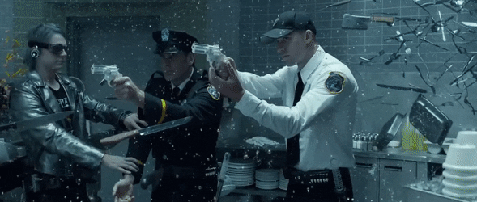

# SnA*ke

Buscando a maneira mais otimizada possível de zerar o Snake Game.

## Pensando sobre o problema
- A cada movimento que a cobra realiza, o grafo que representa o jogo se modifica;
- Logo, `as melhores opções mudam a cada movimento`;
- Assim, tomar sempre as melhores opções no momento podem levar a um game over no futuro?
- E o que parece um game-over agora, uma situação sem saída, pode ser contornada mais a frente?

## Ideias de solução
- Usar um algoritmo de Pathfinding pra achar o caminho mais curto da cabeça da cobra até a comida:
    - BFS, DFS, Dijkstra's, A*...
- Após isso, achar o menor caminho que conecte a comida ao rabo da cobra;
- A junção [cobra + caminho da cabeça da cobra até a comida + caminho da comida até o rabo da cobra] formaria um ciclo;
- Basta que a cobra se mantenha sempre construindo e seguindo esse ciclo até o final do jogo;
- É interessante notar que a cobra pode atualizar o caminho a cada movimento, pois o grafo pode se arranjar de forma a favorecer um ciclo menor;
- Caso um ciclo não seja `menor` que o anterior, continuar seguindo o antigo mesmo;

## Design do game
- A entidade base de todo o jogo é o Node:
    - Ele possui alguns atributos fundamentais, como:
        - Posição (x, y);
	    - Tamanho;
	    - Lista de Nodes (vizinhos) que ele pode acessar diretamente;
    - Os seguintes atores são formados por Nodes ou são especializações de um:
        - O Cenário é um grafo de Nodes;
        - A Cobra é uma lista ligada de Nodes;
        - A comida, um obstáculo e um portal são extensões de um Node, com alguns atributos e métodos a mais;
- Alternativamente, poderíamos criar um único grafo e fazer cenário, cobra, comida, obstáculo e portal armazenarem apenas referências (ponteiros) para os nós do grafo;

## Fluxo de Execução
    1 - Posicionar todos os nós
    2 - Atualizar vetores velocidade
    3 - Mover geral

## Um pouco de teoria

### Grafos

### Algoritmos em Grafos

## Adição de features
- Fazer uma cobra competir com outra pela mesma comida, num mesmo jogo;
- Colocar obstáculos dentro do cenário, formando uma espécie de labirinto;
- Fazer a comida 'fugir' da cobra. Ela poderia se mover aleatoriamente ou ser controlada por um player humano ou um algoritmo;
    - No caso, a maçã seria a comida mais simples, que não se move;
    - Um Mouse poderia se mexer no Stage, um nó de cada vez;
    - Um Frog poderia se mexer também, mas pulando para nós não necessariamente adjacentes;
- Um portal, que conecta dois nós distantes do grafo:
    - A cobra teria uma Portal Gun, que poderia usar para contornar situações difíceis no game;
    - Ela seria recarregada a cada x Foods alcançadas;
    - Evitaria colisão com próprio corpo, parede ou obstáculo;
    - Ele se fecha quando a cobra o atravessa completamente;
    - Animação do portal, igual o do Rick and Morty;
    - Alterar a cor da cabeça da cobra, pra mostrar que a Portal Gun está disponível para uso;
- Cobra com duas cabeças:
    - Ela pode usar uma das cabeças pra se mover, vai depender de qual delas está mais perto da comida;
- Comidas com diferentes 'valores nutricionais':
    - O corpo da cobra cresceria mais ou menos, dependendo do tipo de comida;
- Comidas bônus por tempo limitado, com 'valores nutricionais' mais altos:
    - A cobra deveria ser capaz de dar prioridade e ir atrás da comida de maior xp;

## Conteúdos a serem abordados
- Princípios de Design Orientado a Objetos;
- Modelagem de Software;
- SOLID;
- Clean Code;
- Refatoração;
- Design Patterns;
- Algoritmos de Busca em Grafos;
- Estruturas de Dados;
- Programação Paralela;

## Referências
- 

